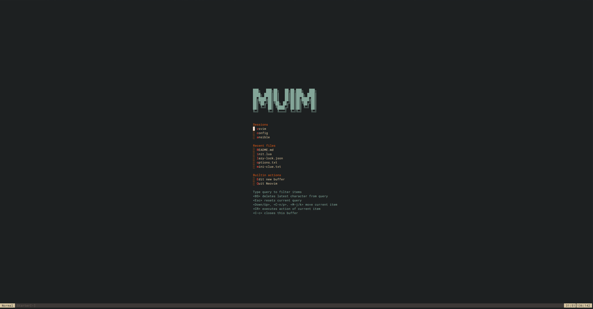
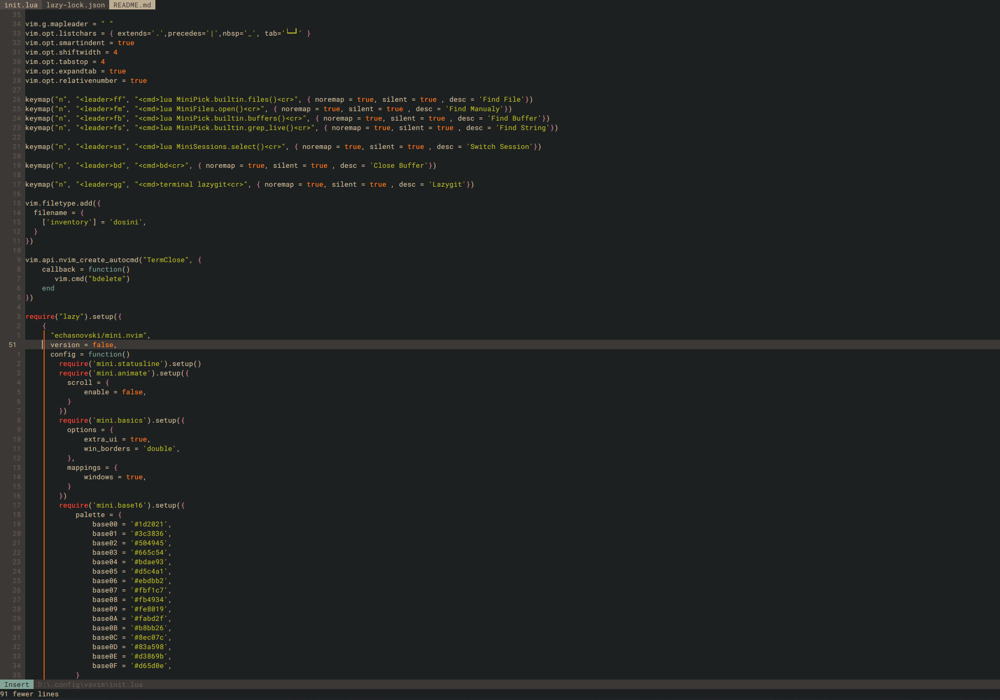

# MVIM

This is my NeoVim Configuration based entirely on [mini.nvim](https://github.com/echasnovski/mini.nvim)
I guess [lazy.nvim](https://github.com/folke/lazy.nvim) too, if we're being honest. It's just more convenient than manualy Updating.

## Why?
Mostly because it's a single plugin with most functionality i need. So i can easily scp this to Servers without Internet Connection and still have my entire NeoVim Setup.
Additionaly, I was getting tired of maintaining a Configuration with as many plugins as i did. I wanted to see what mini has to offer and it turned out it can basically replace all my other Plugins.

No LSP or such though. I don't really use or need that in my day job.
